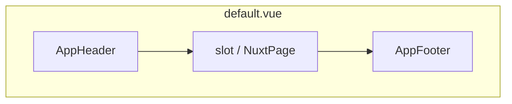

# Каркас одностраничного Nuxt-лендинга

## Контекст

В [procto](https://github.com/...) сейчас нет `package.json` и Nuxt — проект нужно создать с нуля через официальный скaffold.

## Стек

- **Nuxt 3** (стабильный дефолт для новых проектов): `npx nuxi@latest init .` в корне репозитория (или во временную папку с переносом, если `init` не любит непустую директорию — тогда учесть наличие `README.md` / `LICENSE`).
- **Стили**: без лишних зависимостей на первом шаге — **обычный CSS** в компонентах + при необходимости один глобальный файл в `assets/css/main.css` с CSS-переменными (отступы, цвета). Mobile-first: базовые правила без `min-width`, доработки для `min-width: 768px` (или 640px) в `@media`. Так проще поддерживать «просто структуру»; позже можно подключить Tailwind/UnoCSS одной командой.
- **Шрифты**: системный стек на старте.

## Структура файлов (после init)

| Назначение                     | Путь                                                                                                                                                         |
| ------------------------------ | ------------------------------------------------------------------------------------------------------------------------------------------------------------ |
| Глобальные стили (опционально) | [assets/css/main.css](/home/mikhail/projects/procto/assets/css/main.css)                                                                                     |
| Подключение стилей             | [nuxt.config.ts](/home/mikhail/projects/procto/nuxt.config.ts) → `css: ['~/assets/css/main.css']`                                                            |
| Оболочка страницы              | [layouts/default.vue](/home/mikhail/projects/procto/layouts/default.vue)                                                                                     |
| Шапка                          | [components/AppHeader.vue](/home/mikhail/projects/procto/components/AppHeader.vue)                                                                           |
| Подвал                         | [components/AppFooter.vue](/home/mikhail/projects/procto/components/AppFooter.vue)                                                                           |
| Единственная страница          | [pages/index.vue](/home/mikhail/projects/procto/pages/index.vue)                                                                                             |
| Точка входа                    | стандартный [app.vue](/home/mikhail/projects/procto/app.vue) с `<NuxtLayout><NuxtPage /></NuxtLayout>` (если шаблон init уже так делает — оставить как есть) |

## Поведение layout

- **Контентная область**: в `default.vue` — `<main class="...">` с `min-height`, чтобы футер визуально прижимался к низу на коротких экранах (`flex` колонка на `#__nuxt` или обёртке).
- **Хэдер** ([AppHeader.vue](components/AppHeader.vue)):
  - Одна строка на мобиле: слева бургер, по центру или слева после бургера лого (текстовый placeholder или `<NuxtImg>` позже), справа **кликабельный** `tel:` на основной телефон клиники.
  - Бургер переключает `ref`/`v-model` видимости панели навигации (оверлей или выезжающая панель снизу/сбоку — достаточно простого блока под хэдером или full-screen overlay с `z-index`).
  - Пункты меню — заглушки (`NuxtLink` на якоря `#section-id` или на `/` для будущих секций).
  - Доступность: `button` для бургера, `aria-expanded`, при открытии фокус-ловушка не обязательна на первом этапе, но `aria-label` на кнопке — да.
- **Футер** ([AppFooter.vue](components/AppFooter.vue)):
  - Список телефонов (2–3 placeholder номера в константах или props), каждый как `tel:` + визуально разделители/строки для узкого экрана.

## Данные телефонов

Вынести номера в один маленький модуль, чтобы не дублировать между хэдером и футером, например [constants/contacts.ts](/home/mikhail/projects/procto/constants/contacts.ts) с `phones: { label, tel }[]` и `primaryPhone` для хэдера.

## Команды после реализации (для вас / CI)

- `npm install` / `pnpm install`
- `npm run dev` — проверка вёрстки на узкой ширине и после `min-width` breakpoint.

## Что намеренно не делаем на этом шаге

- Реальный логотип-изображение (только placeholder).
- Наполнение секциями лендинга (только пустой/минимальный блок в `index.vue`).
- i18n, SEO-модули, аналитика.

